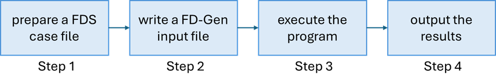
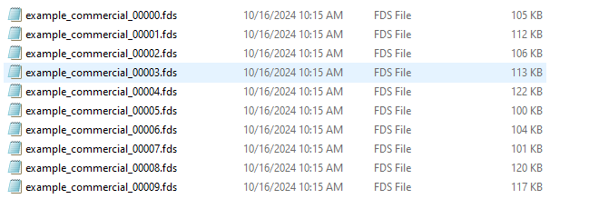
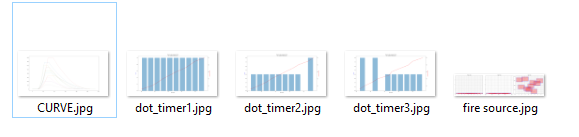
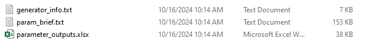
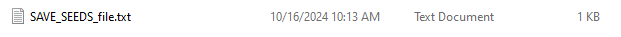

# Fire Data Generator (FD-Gen)  v1.0.0

**Release Name**: FD-Gen v1.0.0

**Release Date**: [Dec 9, 2024]

**Version**: 1.0.0

---


## Getting started
**Fire data generator (FD-Gen)** is a Python-based automated tool designed to streamline the creation of multiple FDS case input files. 

The tool is developed using the Python programming language. it generates random values for key fire parameters and integrates them directly into FDS code lines, enabling users to efficiently produce a large volume of FDS case files within specified parameter ranges. The current version of FD-Gen supports the randomization of various fire parameters, including fire source locations, vent locations, door or window opening sequences, obstruction sizes, fire heat release rate (HRR) curves, and other related parameters.

The workflow of FD-Gen is shown below. It consists of 4 main steps.




## installation instructions
This project provides a GitHub repository for those interested in obtaining and testing FD-Gen. The current location of the repository is https://github.com/usnistgov/FD-Gen. The repository contains both the [**source code**](main_code) and the executable file [**FD-Gen.exe**](FD-Gen.exe). The FD-Gen executable has been tested and confirmed to work effectively on Windows 10 and 11-based personal computers with FDS version 6.9.1. For users utilizing the Python source code, the environment requirements for the dependencies are listed below. Ensure that these dependencies are installed in your Python environment before running FD-Gen:

Python	    3.11 or higher

Numpy	      1.26.4

Pandas	    2.2.3

Scipy	      1.14.1

Matplotlib	3.9.2

Openpyxl	  3.1.5


## Usage approach 
### Step 2: write the FD-Gen input file.
To prepare the FD-Gen input file.

Each data generation project in FD-Gen is controlled by code lines of text-based FD-Gen script embedded within the original FDS case input file. 
This script employs a four-letter-based naming convention for its namelist code lines to define randomized parameters and values within the FD-Gen input file. This structured approach mirrors the conventions used in FDS and CFAST, ensuring consistency and enabling an easier transition for existing FDS users. For detailed instructions on how to write FD-Gen input files and view examples, please refer to the NIST technical note at https://doi.org/10.6028/NIST.XXX.XXXX.

The following folder contains several examples of prepared FD-Gen input files.

[**FD-Gen Input File Examples**](example)

### Step 3: execute the program
To open a terminal and use the command to navigate to the location of the FD-Gen main program, and then read an input file using FD-Gen.
1. Open the terminal.
2. Change the current working directory to your local repository.
3. Read the input file with FD-Gen.

    ```bash
    .\FD-Gen <FD-Gen project name>.fds
    ```
      or

        python FDSdata.py <FD-Gen project name>.fds
    

4. sample the parameter value data.

Once the FD-Gen input file is executed, the program reads the FD-Gen code lines and performs basic code checking and parameter sampling. users can review the sampled parameter values in the **PARAMETER_FILE_FOLDER** located within the project folder. If the sampling aligns with the design, you can proceed with the program in the terminal. Otherwise, you'll need to return to the FD-Gen input file to modify the script guiding the parameter sampling.


5. wrap the FDS input file.

The file wrapping process is responsible for generating the FDS case input files based on the sampled data. As a result, multiple FDS input files, as designed, will be generated and saved in the project folder under **CASE_FOLDER**.


### Step 4: acquire the outputs.
In addition to the spreadsheet containing the sampled parameter value information in the **PARAMETER_FILE_FOLDER** and the FDS input files in the **CASE_FOLDER**, FD-Gen also provides outputs to plot sampled fire source locations, HRR curves, and value distributions. These visual outputs give users a comprehensive view of the data and help ensure the reproducibility of the dataset. The output files are saved in the project folder under **OUTPUT_FOLDER**.


## Example

### Start
[**commercial building fire case**](example/example_commercial.fds)

1. download **FD-Gen.exe** and the example input file **example_commercial.fds**

2. open a terminal

3. change the current working directory to your local repository

4. read the FD-Gen input file with FD-Gen

5. check FD-Gen script and sample the data.
type Y or y to continue the following steps.

6. finish
project folder **example_commercial** will be created under the current working directory.

### Breakdown of the output files

**CASE_FOLDER**
The CASE_FOLDER contains multiple FDS case input files generated based on the sampled values designed in the input FD-Gen file configuration. 



**Figure 2.** example of CASE_FOLDER.

**OUTPUT_FOLDER**
The OUTPUT_FOLDER contains visualizations of the sampled data, including plots of fire source locations, HRR curves, and specific value distributions. 



**Figure 3.** example of OUTPUT_FOLDER.

**PARAMETER_FILE_FOLDER**
The PARAMETER_FILE_FOLDER contains a spreadsheet with the sampled parameter values for each case, along with a text file providing a summary of the parameter values. 



**Figure 4.** example of PARAMETER_FILE_FOLDER.

**SEEDS_FOLDER**
The SEEDS_FOLDER contains the seeds used for the project, ensuring reproducibility of the sampling process in the future. 



**Figure 5.** example of SEEDS_FOLDER.

## Documentation
For detailed instructions and example on using FD-Gen, please refer to the NIST technical note at https://doi.org/10.6028/NIST.XXX.XXXX.

## Citation
Author (Year) Title. (National Institute of Standards and Technology, Gaithersburg, MD), NIST Series (Series Abbreviation) Publication ID. https://doi.org/10.6028/NIST.XXX.XXXX 


---

[usnistgov/FD-Gen] is developed and maintained
by Hongqiang Fang and Andy Tam, principally:

- Hongqiang (Rory) Fang, @hqfang3

Please reach out with questions and feedbacks to Hongqiang (Rory) Fang <hongqiang.fang@nist.gov> and Andy Tam <waicheong.tam@nist.gov>.
